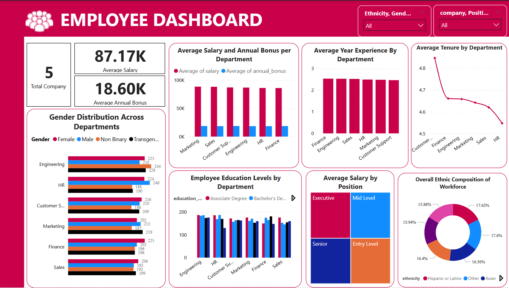
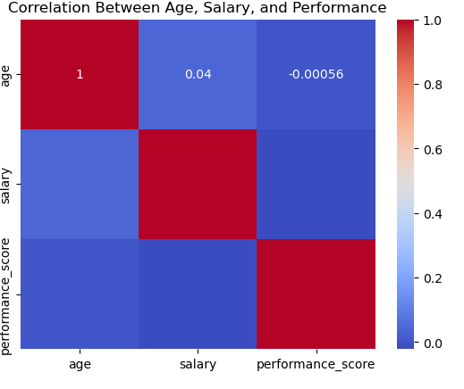

## 📊 Employee Analysis & Workforce Optimization

 
A Data-Driven Insight into Employee Demographics, Performance & Compensation Using SQL, Python, and Power BI. 

## Overview

This project focuses on analyzing a company's employee dataset to drive smarter HR and management decisions. Through a combination of data cleaning, demographic analysis, compensation insights, and predictive modeling, the report delivers actionable workforce intelligence powered by SQL, Python, and Power BI.

## 📈 Key Business Questions Answered
- 🧹 Is the employee data clean and consistent enough to perform reliable analysis?
- 👥 What does the demographic composition of our workforce look like?
- ⚖️ Are we maintaining gender balance across departments?
- 🏆 Which departments are high-performing—and which need support?
- ⏳ How long do employees typically stay in each department?
- 📉 Is there any relationship between age, salary, and performance?

## 🧰 Tools & Technologies
- SQL — for data structuring, cleaning, and feature engineering
- Python (Pandas, NumPy) — for advanced analytics and statistical modeling
- Power BI — for real-time, interactive dashboards

## 📊 POWER BI Dashboard 

1. Compensation Overview
- Average Salary: 87.17K
- Average Annual Bonus: 18.60K
- The Marketing and Sales departments report the highest average salaries, indicating potentially higher performance or strategic importance.
2. Work Experience & Tenure
- Finance and Engineering departments have employees with the highest prior experience.
- Customer Support shows the longest average tenure, suggesting strong employee retention.
3. Gender Distribution
- All departments have a relatively balanced distribution across Female, Male, Non-Binary, and Transgender employees, reflecting efforts toward gender diversity.
4. Educational Background
- Employees possess a wide range of educational qualifications.
5. Salary by Position
- Salary range are almost the same for all position.
6. Ethnic Diversity
- The workforce is ethnically diverse, with no single group dominating.
- Representation includes Hispanic, Black or African American, White, Asian, and Others, supporting an inclusive organizational culture.
7. Dashboard Interactivity
- The dashboard includes filters for Ethnicity, Gender, Department, Company, and Position, allowing dynamic exploration of specific employee segments.

_You can access and interact with the Power BI dashboard_ [here](https://github.com/sameera-explores-data/Employee-Analysis-Workforce-Optimization/blob/main/Employee_PowerBI_Dashboard.pbix)

## 📉 Tenure & Retention Analysis Using Python

- A new column was created as calculated tenure, this gives the exact years the employee has spent in the company. 
Perform statistical analysis on average tenure by department, age group, or gender.
- The report shows that employees stay in the company for about 4.5 to 4.9 years on average, depending on the department. Customer Support has the highest average tenure, while HR has the lowest. Employees aged 30–35 stay the longest, while those aged 41–45 stay the shortest. Across genders, tenure is very similar, with transgender employees staying slightly longer than others. Overall, tenure is quite balanced, but there are some negative values that may be data errors and should be checked.

## ⏳ Predictive Insights
Applied correlation analysis to understand relationships among age, performance, and salary.

The correlation analysis shows that age, salary, and performance don’t have strong relationships with each other. Age has almost no effect on salary or performance. Likewise, employees with higher salaries don’t necessarily perform better. Overall, these three factors appear to be unrelated in this dataset. 

_You can access the Python file_ [here](https://github.com/sameera-explores-data/Employee-Analysis-Workforce-Optimization/blob/main/Employee_Project_Python.ipynb)

📈 Key Insights
- ✅ Gender, age, ethnicity, and education distributions reveal a highly inclusive and balanced workforce
- 💰 Salary analysis shows no significant pay disparity across gender or departments
- 🧠 Performance and compensation are consistent, with top performance from Marketing and HR
- ⏳ Tenure analysis suggests employees average 4.5–4.9 years with highest retention in Customer Support
- 🔮 Correlation analysis finds no strong relationships between age, salary, and performance—suggesting unbiased evaluation and compensation structures

## Conclusions

The analysis of the employee dataset reveals that the organization maintains a well-balanced and inclusive workforce across gender, ethnicity, education, and departments. Salaries are fairly distributed across gender and positions, with no major disparities. Most departments show consistent performance and healthy tenure levels, suggesting strong retention strategies and employee satisfaction.

## Recommendations
- Training Opportunities: Although no department currently shows poor performance, regular upskilling and support programs can sustain high performance across the board.
- Predictive Insights: Expand data tracking (e.g., engagement scores, project completion rates) to enable more meaningful predictive modeling in the future.
- Dashboard Use: Continue leveraging Power BI for real-time monitoring, and expand its use across managerial teams for data-driven decisions.

*By implementing these recommendations, the organization can optimize revenue, enhance customer satisfaction, and improve workforce efficiency, ensuring sustained growth and profitability.* 🙂

## 📂 Folder Structure
- PowerBI_Dashboard.png #Screenshot of the Power BI Dashboard
- Python_Output.png #Screenshot of the Python analysis output
- Employee_Queries.SQL #SQL file
- Employee_Analysis_Project_Report.pdf #Detailed written report with insights
- README.md #Project documentation

## 🚀 How to Use
1. Download the `.pbix` file (Power BI file) from the repository.
2. Open with Power BI Desktop.
3. Connect to the provided Excel data source (if shared).
4. Explore the dashboard visuals and adjust filters as needed.

## 📝 Report Summary
A detailed written report is included in this repo (`Employee_Analysis_Project_Report.pdf`), summarizing all analytical findings and strategic recommendations for business optimization.

---
[Employee_Analysis_Workforce_Report.pdf](https://github.com/sameera-explores-data/Employee-Analysis-Workforce-Optimization/blob/main/Employee_Analysis_Project_Report.pdf)

## 📌 Note
If you find this project insightful, feel free to star ⭐ the repo or connect with me for freelance collaborations or dashboard development projects.

